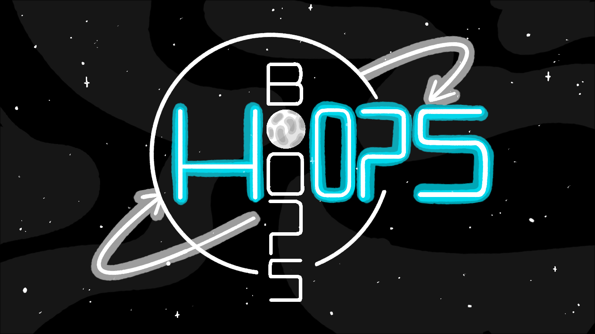

# Boops and Hoops

Beautifully simplistic idle game made by Yuvelk Lopez-Garcia,
Kaiden McCready, and Joel Singh as part of the 2025 GMTK Game
Jam. Made with love using [Bevy](https://bevy.org/).

- Art done by Yuvelk
- Sound done by Kaiden
- Programming done by Kaiden and Joel

## Playing The Game

Simply download and run the executable from: https://joel-eats-apples.itch.io/hoops-and-boops

## Compiling Instructions

This game was made in Rust using the Bevy Game Engine. To compile, you'll need
the Rust package manager Cargo and Bevy OS Dependencies.

1. Install Cargo: https://doc.rust-lang.org/cargo/getting-started/installation.html
2. Install the Bevy dependencies: https://bevy.org/learn/quick-start/getting-started/setup/#installing-os-dependencies
3. In a terminal run `cargo run`
